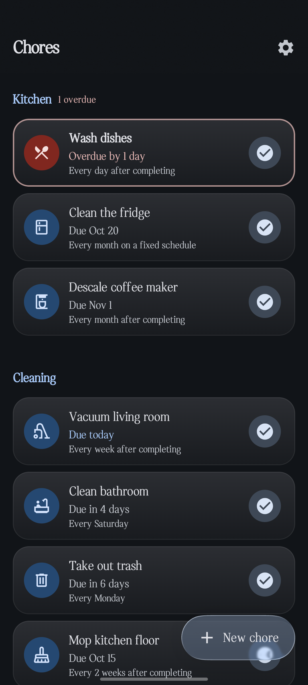
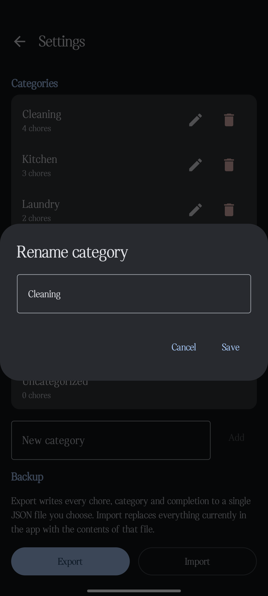
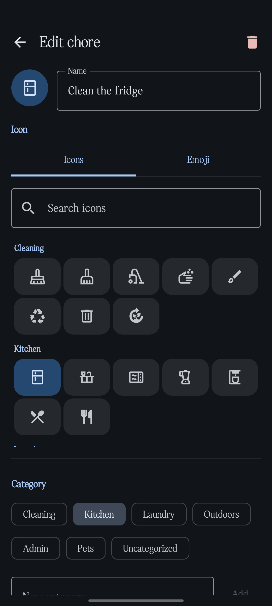
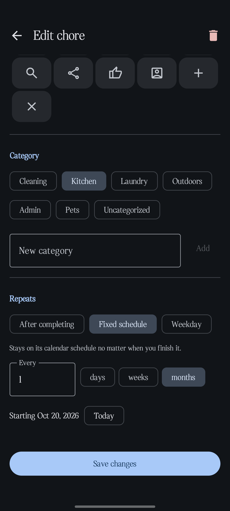
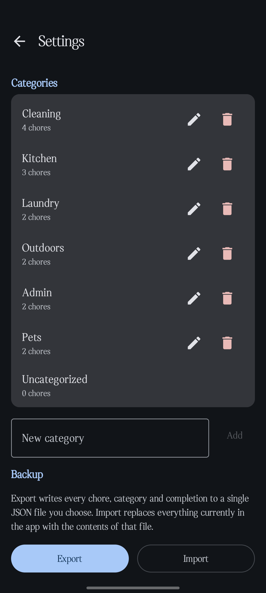
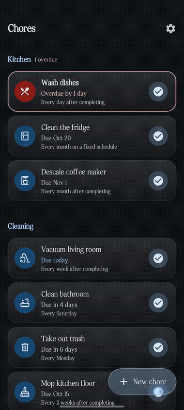
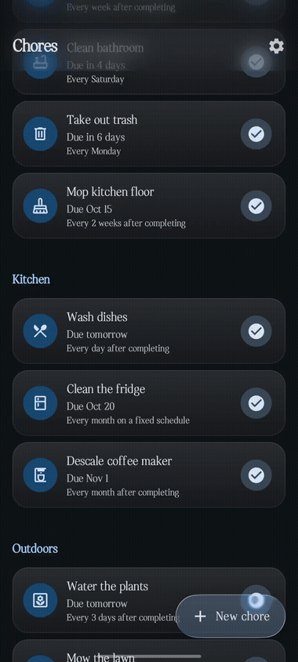
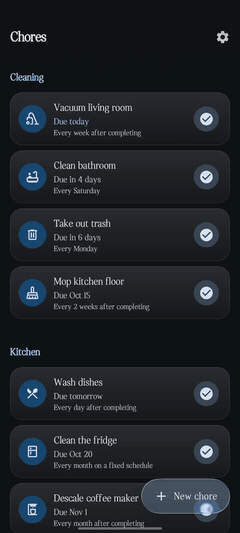

# Chore Reminder



An Android app for the chores that are too small or too frequent to put on a calendar: vacuuming, changing bed sheets, feeding the cat, cleaning out the fridge. You mark something done, it figures out when it's due again. No account, no server, nothing syncing anywhere.

I kept trying to use my calendar for this and hating it. Chores don't have a time of day, they repeat on their own schedule, and "done" should bump the next occurrence forward instead of leaving a stale event sitting there. None of that maps onto a tool built for meetings, so I built something that only has to think about one kind of thing.

It's deliberately small. Add a chore, set how often it repeats, get told when it's due, tick it off. There's no streak counter and no points, because I didn't want this turning into another app I have to manage.

<br clear="left"/>

## What it does



Chores live in categories you define yourself — Kitchen, Laundry, Admin, Pets, whatever matches how you actually think about your place. Rename one and everything under it follows along automatically. Delete one and its chores get reassigned to Uncategorized rather than disappearing, since renaming a folder shouldn't be how you lose a chore's history by accident.

<br clear="right"/>



Picking an icon for a chore doesn't mean scrolling through a dozen icons that have nothing to do with housework. `material-icons-extended` would've added 66 MB to the APK just to get a handful of usable icons, so I pulled out a set of about 100 and grouped them by category — cleaning, kitchen, laundry, outdoors, admin, pets. If none of them fit, the system emoji keyboard is right there too (🐱 covers "feed the cat" just fine).

<br clear="left"/>



The part I spent the most time getting right is recurrence, because chores don't all repeat the same way. Watering the plants should reschedule from whenever you actually got to it — every 3 days from today, not from some grid. Rent is different: it's due on the 15th no matter whether you paid early or late. So there are two modes:

- **Relative** — next due date is completion date plus the interval. Forgiving if you're late.
- **Fixed** — anchored to a date or weekday, regardless of when you complete it.

<br clear="right"/>



Settings has an export/import pair instead of an account system. Export writes every chore, category, and completion to one JSON file you control; import reads it back. That's it, that's the whole backup story, and it's really just for the day you get a new phone.

When something's due, you get a notification with a one-tap complete action right on it, so you don't have to open the app at all. Leave it alone and it'll remind you again the next day instead of getting lost in the tray.

The color scheme follows your wallpaper on Android 12+, it respects system light/dark mode, and the surfaces that benefit from a bit of blur — the top bar, the add-chore button — get it. I kept it off the scrolling list itself, since blurring something that's constantly moving just makes it harder to read.

<br clear="left"/>

## A few demos

<table>
<tr>
<td><br/><sub>Marking an overdue chore complete — the card re-sorts and the due date rolls forward</sub></td>
<td><br/><sub>The liquid-glass FAB opening into the new-chore flow</sub></td>
<td><br/><sub>Scrolling through categories on the home screen</sub></td>
</tr>
</table>

## Offline, for real

Check the manifest and there's one permission: `POST_NOTIFICATIONS`. No `INTERNET`, no account, nothing phoning home. That's not an oversight I forgot to fix — the whole point of this app was getting chores off a cloud-synced to-do list and onto a device that doesn't care if it has signal.

## Built with

Kotlin and Jetpack Compose (Material 3), with an MVVM setup and a small repository layer in between. Room handles storage, WorkManager fires the reminders, DataStore holds preferences, and kotlinx.serialization writes the backup JSON. The frosted-glass bits use [Haze](https://github.com/chrisbanes/haze) for the blur and [Kyant0's backdrop/shapes libraries](https://github.com/Kyant0/AndroidLiquidGlass) for the liquid-glass refraction on the add-chore button.

The recurrence math lives in its own pure-Kotlin module with no Android dependencies at all, which made it easy to throw a real test suite at it — interval math, month-end clamping (Jan 31 rolls to Feb 28, then recovers to Mar 31), leap years, the due/overdue boundary.

There's no DI framework. It's four screens and a hand-rolled container in `ChoreApp.kt` does the job without pulling in Hilt for something this size.

## Running it

You'll need Android Studio with the SDK for Android 12 (minSdk 31 — that's the minimum for dynamic color).

```bash
./gradlew :app:installDebug
```

Release builds are signed with the debug key on purpose. This isn't going on the Play Store, so the only thing that matters is being able to drop the APK on my phone and install it.

## What's not here

No multi-user support, no cloud sync, no calendar integration, no exact-alarm permission dialogs, no streaks or badges. Each of those got left out on purpose rather than cut for time — this is meant to stay a small app that does one thing, not grow into a second calendar.

## License

MIT — see [LICENSE](LICENSE).
